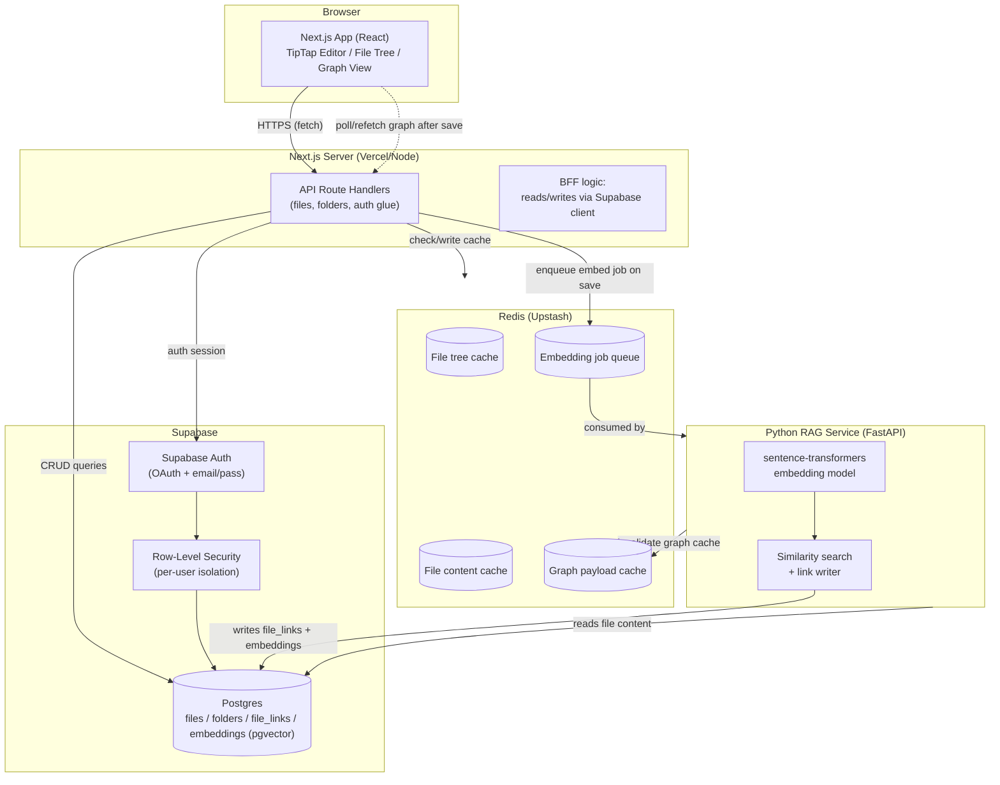
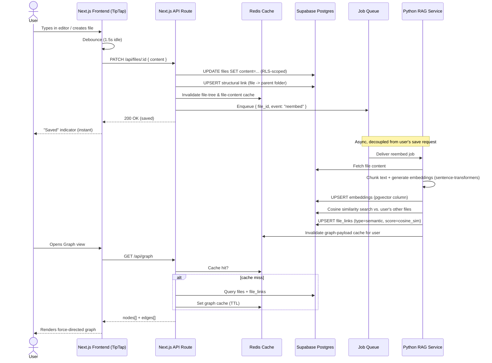

# Product & Engineering PRD — "NoteGraph" (working name)
### Obsidian-style knowledge base with AI-powered document linking

**Author:** Engineering
**Status:** Draft v1 — MVP scope
**Last updated:** 2026-08-19

---

## 1. Problem Statement

Knowledge workers accumulate notes across many files and folders but lose the *connections* between them.
Tools like Obsidian solve local-first linking manually (via `[[wikilinks]]`), but require the user to
remember and create links themselves. We want a **web-based**, **multi-user**, **cloud-synced** notes app
that:

- Lets users organize notes in nested folders (like a filesystem).
- Gives them a rich-but-lightweight text editor (bold / italic / underline / highlight, markdown-aware).
- **Automatically** discovers relationships between notes using semantic similarity (RAG), not just
  manual linking — reducing the cognitive load of maintaining a "second brain."
- Visualizes those relationships as an interactive graph.

## 2. Goals (MVP)

| # | Goal |
|---|---|
| G1 | User auth via Supabase (OAuth providers + email/password) |
| G2 | CRUD for nested folders and text files (`.md` and plain text) |
| G3 | Rich text editing surface: bold, italic, underline, highlight; loads existing file content |
| G4 | Auto-link every new/edited file to its parent folder (structural link) |
| G5 | Auto-link every new/edited file to semantically related files via RAG (semantic link) |
| G6 | Graph view in nav showing all files as nodes, links (structural + semantic) as edges |
| G7 | Redis caching layer for hot-path reads (file tree, recent files, graph data) |

## 3. Non-Goals (explicitly out of scope for MVP)

- Real-time multi-user collaborative editing (co-editing same file simultaneously) — single-editor-at-a-time only.
- Version history / time-travel on files.
- Mobile native apps.
- Public sharing / publishing of notes.
- Plugin system (Obsidian-style plugins).
- Non-text file types (images, PDFs as attachments) — text/markdown only for MVP.
- Fine-grained permissions/sharing between users (single-tenant-per-user for MVP; every user only sees their own vault).

These are natural **Phase 2** candidates — noted again in §14.

## 4. User Personas

- **Primary:** an individual knowledge worker / student / engineer who wants a personal "second brain" —
  single user per account, no team/sharing concerns at MVP.

## 5. Core Feature Breakdown

### 5.1 Authentication
- Supabase Auth: email + password, and OAuth (Google, GitHub to start).
- Session handled via Supabase's SSR helper in Next.js (cookie-based sessions, not localStorage — required
  for server components / API routes to read the session).
- Row-Level Security (RLS) enforced on **every** Supabase table — a user can only ever read/write rows
  where `user_id = auth.uid()`. This is not optional; it's the entire multi-tenant security model here.

### 5.2 Folder & File System
- Folders are self-referential (`parent_folder_id`) — arbitrary nesting depth.
- Files belong to exactly one folder (or a root/null folder).
- Files store raw content (markdown/text) in Postgres (`text` column) for MVP — not Supabase Storage.
  Rationale: files are small (text notes), and keeping content in Postgres means we can index, full-text
  search, and transactionally update content + links + embeddings together. Revisit if average file size
  or attachment support grows (→ move to Supabase Storage + reference).
- Rename/move/delete operations cascade correctly (moving a folder moves its subtree; deleting a folder
  either cascades or requires empty — MVP: cascade delete with a confirmation modal on the frontend).

### 5.3 Editor
- **TipTap** (ProseMirror-based) as the editor core.
- Marks supported at MVP: **bold**, *italic*, <u>underline</u>, ==highlight==.
- TipTap's content model is JSON; we serialize to Markdown for storage (using `tiptap-markdown` or a
  custom serializer) so files remain portable, greppable, diffable plain text — consistent with the
  "files are just markdown" philosophy (Obsidian does the same).
- Autosave: debounced save (e.g. 1.5s after last keystroke) → PATCH to API → triggers async re-embedding job.
- Loading a file: fetch content from API (cache-through Redis) → parse Markdown → hydrate TipTap JSON.

### 5.4 Document Matching System (RAG-based auto-linking)

This is the core differentiator. Two link types are produced per file:

1. **Structural link** — trivial, synchronous: file → its parent folder. Stored the moment the file is
   created; no ML involved.
2. **Semantic link** — the RAG part. On every create/significant-edit event:
   - Chunk the file content (simple recursive chunking, ~500 tokens/chunk with overlap).
   - Generate embeddings per chunk via a self-hosted `sentence-transformers` model
     (e.g. `all-MiniLM-L6-v2` — 384-dim, fast on CPU, good enough for MVP).
   - Store embeddings in a Postgres table with a `pgvector` column.
   - Run a cosine-similarity nearest-neighbor query against all other files owned by the same user.
   - Files above a similarity threshold (tunable, start at 0.75) become semantic links, written to a
     `file_links` table with a `similarity_score` and `link_type = 'semantic'`.
   - Re-embedding is **async** (queued job, not blocking the save request) — user sees "saved" instantly,
     links update a few seconds later.

### 5.5 Graph View
- New nav item → full-screen graph.
- Nodes = files (grouped/colored by folder). Edges = `file_links` rows (structural edges thin/gray,
  semantic edges colored by strength).
- Rendered client-side with a force-directed layout library (`react-force-graph` or `d3-force`).
- Graph data fetched from a dedicated endpoint, cached in Redis (invalidated on any link change) since
  recomputing all edges on every graph-view open would be wasteful.

### 5.6 Caching (Redis)
Redis is used for **read-through caching**, not as a source of truth. Cached, with short TTL + explicit
invalidation on writes:
- File tree (folder hierarchy) per user
- Individual file content (hot files)
- Graph payload (nodes + edges) per user
- Session/user lookups (optional, Supabase already handles this reasonably)

---

## 6. Tech Stack

| Layer | Choice | Why |
|---|---|---|
| Frontend | Next.js (App Router) | SSR for fast initial load, API routes double as BFF |
| Backend (CRUD, auth glue) | Next.js API routes / Route Handlers | Co-located with frontend, simplest ops for MVP |
| RAG / embedding service | Python (FastAPI) — separate service | `sentence-transformers` is Python-native; keeps heavy ML deps out of the Node process |
| Database | Supabase (Postgres) | Auth + relational data + pgvector, one system instead of three |
| Vector store | `pgvector` extension on Supabase Postgres | Avoids standing up a second database at MVP scale |
| Auth | Supabase Auth (OAuth + email/password) | Built-in, RLS integrates natively |
| Cache | Redis (e.g. Upstash for serverless-friendly hosting) | Read-through cache for file tree, content, graph |
| Editor | TipTap (ProseMirror) | Real document model, extensible marks, markdown-serializable |
| Graph rendering | `react-force-graph` (d3-force under the hood) | Mature, handles force-directed layout out of the box |
| Job queue (async embedding) | Redis-backed queue (BullMQ from Node, or a simple Postgres `jobs` table polled by the Python service) | Decouples "save file" from "compute embeddings" |

**Why a separate Python service instead of doing RAG in Next.js?** Node has no first-class
`sentence-transformers` equivalent; shelling out to Python from Node per-request is fragile. A small
FastAPI service is cleaner, independently scalable, and testable in isolation.

---

## 7. System Architecture



---

## 8. Data Flow — "Create/Edit File → Auto-Link" (the core loop)



---

## 9. Data Model (Postgres / Supabase)

```sql
-- Folders (self-referential for nesting)
create table folders (
  id uuid primary key default gen_random_uuid(),
  user_id uuid not null references auth.users(id),
  name text not null,
  parent_folder_id uuid references folders(id) on delete cascade,
  created_at timestamptz default now(),
  updated_at timestamptz default now()
);

-- Files
create table files (
  id uuid primary key default gen_random_uuid(),
  user_id uuid not null references auth.users(id),
  folder_id uuid references folders(id) on delete cascade,
  title text not null,
  content text not null default '',       -- markdown source of truth
  file_type text not null default 'md',   -- 'md' | 'txt'
  created_at timestamptz default now(),
  updated_at timestamptz default now()
);

-- Chunk-level embeddings for RAG
create table file_embeddings (
  id uuid primary key default gen_random_uuid(),
  file_id uuid not null references files(id) on delete cascade,
  user_id uuid not null references auth.users(id),
  chunk_index int not null,
  chunk_text text not null,
  embedding vector(384),   -- pgvector, matches all-MiniLM-L6-v2 dim
  created_at timestamptz default now()
);
create index on file_embeddings using ivfflat (embedding vector_cosine_ops);

-- Links (both structural and semantic)
create table file_links (
  id uuid primary key default gen_random_uuid(),
  user_id uuid not null references auth.users(id),
  source_file_id uuid not null references files(id) on delete cascade,
  target_file_id uuid references files(id) on delete cascade,     -- null if target is a folder
  target_folder_id uuid references folders(id) on delete cascade, -- structural link target
  link_type text not null check (link_type in ('structural','semantic')),
  similarity_score float,   -- only for semantic links
  created_at timestamptz default now(),
  unique (source_file_id, target_file_id, link_type)
);

-- RLS (applied to every table above)
alter table folders enable row level security;
alter table files enable row level security;
alter table file_embeddings enable row level security;
alter table file_links enable row level security;

create policy "user isolation" on files
  for all using (auth.uid() = user_id);
-- (repeat equivalent policy for folders, file_embeddings, file_links)
```

## 10. API Surface (MVP)

| Endpoint | Method | Purpose |
|---|---|---|
| `/api/folders` | GET/POST | List / create folders |
| `/api/folders/:id` | PATCH/DELETE | Rename, move, delete folder |
| `/api/files` | GET/POST | List files (by folder) / create file |
| `/api/files/:id` | GET/PATCH/DELETE | Load, save, delete file |
| `/api/graph` | GET | Nodes + edges for graph view (cached) |
| `/api/search` | GET | Full-text + optionally semantic search |
| **Python service (internal, not client-facing):** | | |
| `POST /internal/embed` | | Triggered by job queue: embed + link a file |

---

## 11. Non-Functional Requirements

- **Security:** RLS on every table (non-negotiable); no service-role key ever exposed client-side; OAuth
  redirect URLs locked to allow-listed domains.
- **Performance targets (MVP):** file open < 300ms (cache hit), file save round-trip < 200ms (embedding
  happens async so it's off the critical path), graph load < 1s for up to ~500 files.
- **Reliability:** if the Python RAG service is down, file save/edit must still succeed — semantic linking
  degrades gracefully (job stays queued, retried later). This is a hard requirement — the editor must
  never block on RAG availability.
- **Cost control:** self-hosted embeddings avoid per-call API cost; cap chunk count per file to bound
  embedding compute.

## 12. Key Engineering Risks / Open Questions

1. **Similarity threshold tuning** — 0.75 is a starting guess; needs empirical tuning once real content
   exists, or it'll either over-link (noisy graph) or under-link (feels broken).
2. **Re-embedding cost at scale** — every edit re-embeds the whole file. Fine for MVP; at scale, consider
   only re-embedding changed chunks (diff-based).
3. **Job queue choice** — BullMQ (Redis-backed) vs a simple Postgres-polling table. Recommend BullMQ for
   MVP since Redis is already in the stack; simpler ops than adding a queue-specific dependency later.
4. **Graph rendering performance** at higher file counts (1000+) may need clustering/virtualization —
   not a blocker for MVP-scale usage.

## 13. Milestones (suggested build order)

| Phase | Scope |
|---|---|
| M1 | Auth (Supabase OAuth + email/pass), folder/file CRUD, basic file tree UI |
| M2 | TipTap editor integrated, load/save file content, autosave |
| M3 | Structural linking (file → folder) + `file_links` table wired up |
| M4 | Python RAG service: chunking, embedding, pgvector similarity, semantic linking, async job queue |
| M5 | Graph view (nodes/edges rendering, Redis-cached payload) |
| M6 | Redis caching pass across file tree / file content / graph; polish, error states, empty states |

## 14. Post-MVP / Phase 2 Candidates

- Manual `[[wikilink]]`-style linking alongside auto-linking.
- File sharing / multi-user collaboration on the same vault.
- Real-time co-editing (would require CRDT/OT — Yjs is the natural fit if this becomes a requirement).
- Attachments (images, PDFs) via Supabase Storage.
- Full-text + hybrid (keyword + semantic) search.
- Version history.
